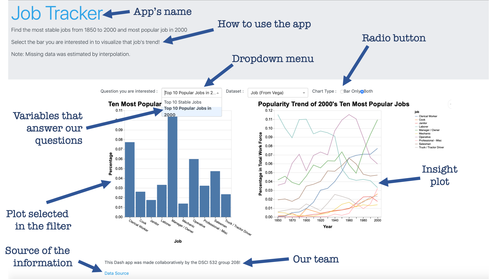

# DSCI_532_Group_208_Job
Milestone 1

### Team members
Huayue (Luke) L.: [mglu123](https://github.com/mglu123)  
Manish J.: [ManishPJoshi](https://github.com/ManishPJoshi)  
Victor C.: [vcuspinera](https://github.com/vcuspinera)  

## DESCRIPTION OF THE APP & SKETCH

View our app [here](https://dsci-532-group-208-milestone2.herokuapp.com)

The central purpose of this app is to be a quick guiding tool to any person who wants to know which are the professions that are still standing relevant, which are the ones that have gained in popularity and, which are the ones that have fallen by the wayside.

### Our App
- The app consists of two major portions. The menu panel on the left and the plots on the right side of the screen. The Menu panel consists of a drop-down menu and a radio button and have a hamburger menu which allows the user to collapse the menu panel and get an enlarged view of the plots.  
  
- The radio button will allow the user to make a selection of what data category he/she wants to visualize, and the radio button shall enable which kind of plots are to be visualized.  
  
- The plots panel on the right side of the screen consists of 2 plots stacked one above the other. The top graph is a vertical bar plot while the lower plot is a multiple line chart. The plots would be interactive, and making a selection on the top graph will highlight a corresponding line on the plot. Both plots will have the ability to be panned and zoomed. There shall be an effective use of color as deemed necessary during the implementation.  
  

### The App's Sketch

This is the general view of the app:

  
  
This is how it works when a selection is made by the user:
