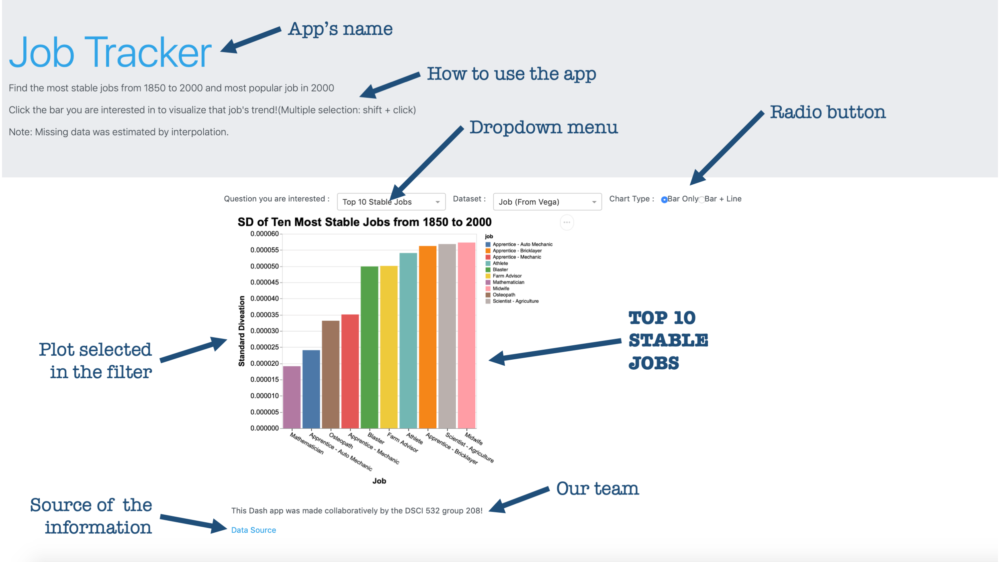
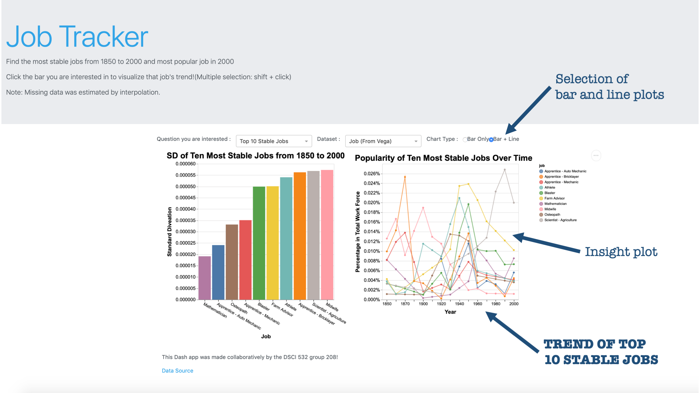
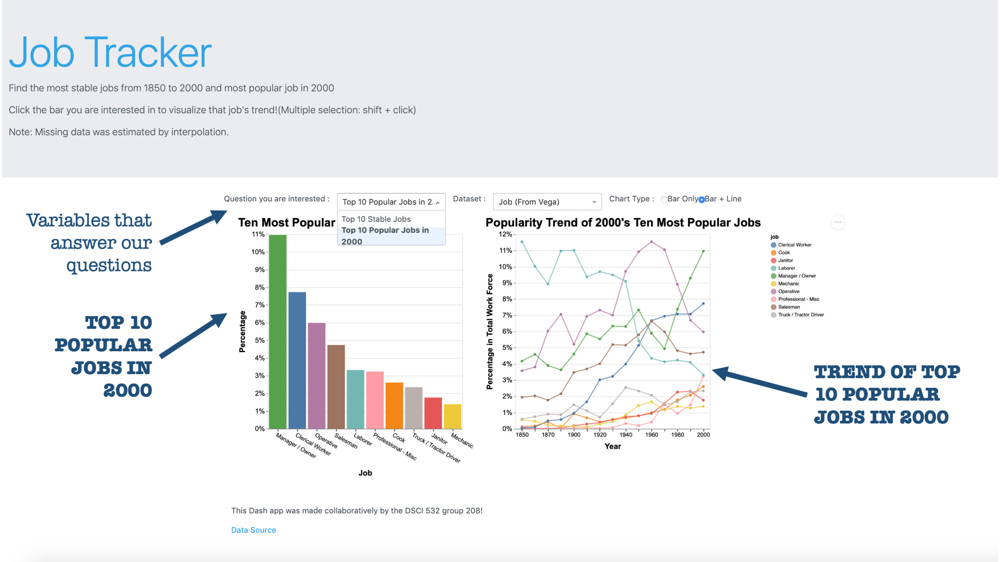
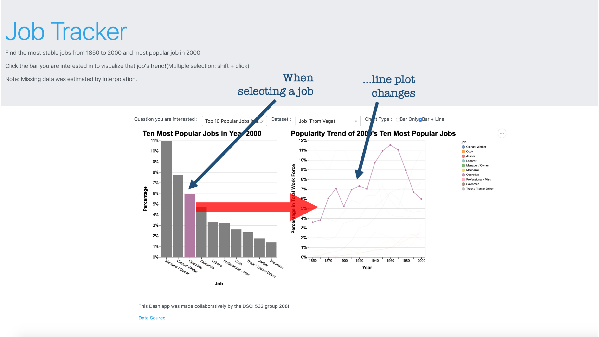

# DSCI_532_Group_208_Job
Milestone 1

### Team members
Huayue (Luke) L.: [mglu123](https://github.com/mglu123)  
Manish J.: [ManishPJoshi](https://github.com/ManishPJoshi)  
Victor C.: [vcuspinera](https://github.com/vcuspinera)  

## DESCRIPTION OF THE APP & SKETCH

The central purpose of this app is to be a quick guiding tool to any person who wants to know which are the professions that are still standing relevant, which are the ones that have gained in popularity and, which are the ones that have fallen by the wayside.

### Our App

The link to our app on Heroku. [here](https://dsci-532-group-208-milestone3.herokuapp.com)

- The app consists of 2 sections. The menu section at the top allows the user to choose the data he or she would like to visualize. The section below is the plot section and this is where the data is visualized. 

- The menu section comprises of 2 dropdown menus. The first dropdown menu allows the user to choose between the "top 10 most stable jobs over time" and "the most popular jobs in the year 2000". The second dropdown menu is to select the dataset to visualize.( this is for future development).  Besides the dropdown menu, there is a radio button that allows the user to choose between Bar plots and line graphs. 

- The plots section primarily consists of 2 plots faceted side by side. The plot on the left is a Vertical bar plot and the plot on the right is a line graph. 

- The user can select the bars in the bar plot and the corresponding line on the line plot will be highlighted to show the trend of the job over a period of time.
 
  
  
### The App's Sketch

- This is the general view of our app when the user arrives into the webpage.

- This is the view when the user selects the radio button for the bar and line plots.

- This is the view when the user selects other question of interest with the dropdown menu.

- This a the view when the user selects a specific job in the bar plot.

